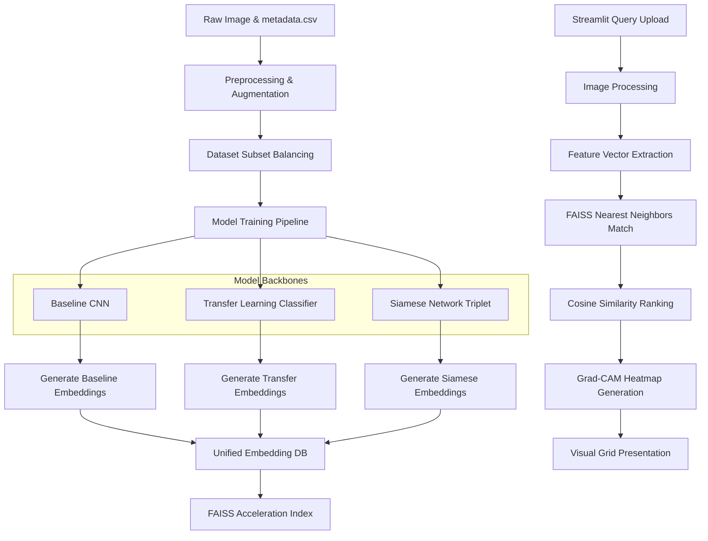

# 🛒 Fashion Product Images Visual Search & Recommendation System

[](https://www.python.org/downloads/)
[](https://tensorflow.org/)
[](https://streamlit.io/)
[](LICENSE)
[](https://github.com/siddhartha-sai-17/Celebal-Excellence-Internship-Final-Project/actions)
[](https://github.com/siddhartha-sai-17/Celebal-Excellence-Internship-Final-Project)

An enterprise-grade, end-to-end deep learning visual search engine that recommends visually similar fashion products from a structured e-commerce catalog. Built with **TensorFlow 2.x**, **FAISS**, and **Streamlit**, it integrates convolutional feature representation, fine-tuned transfer learning classification spaces, and Siamese metric distance networks into a dark-mode glassmorphic user dashboard.

---

## 📌 Table of Contents
1. [Project Overview](#-project-overview)
2. [Problem Statement](#-problem-statement)
3. [Objectives](#-object-objectives)
4. [Project Features](#-project-features)
5. [Application Screenshots](#-application-screenshots)
6. [System Architecture](#-system-architecture)
7. [Technology Stack](#-technology-stack)
8. [Project Directory Structure](#-project-directory-structure)
9. [Dataset Information](#-dataset-information)
10. [Installation Guide](#-installation-guide)
11. [Configuration](#-configuration)
12. [Usage Guide](#-usage-guide)
13. [Pipeline Workflow](#-pipeline-workflow)
14. [Model Architectures](#-model-architectures)
15. [Similarity Search & FAISS](#-similarity-search--faiss)
16. [Evaluation Metrics](#-evaluation-metrics)
17. [Performance Optimization](#-performance-optimization)
18. [Streamlit Modules & Pages](#-streamlit-modules--pages)
19. [Testing Suite](#-testing-suite)
20. [Results & Benchmarks](#-results--benchmarks)
21. [Roadmap & Future Improvements](#-roadmap--future-improvements)
22. [Troubleshooting](#-troubleshooting)
23. [Contributing](#-contributing)
24. [License](#-license)
25. [Acknowledgements & References](#-acknowledgements--references)

---

## 📖 Project Overview
This project implements an advanced image-based product discovery solution that resolves the limitations of text-only search in e-commerce. By transforming images into high-dimensional vector representations, the system performs nearest-neighbour retrieval to recommend fashion items matching the style, colour, shape, and pattern of a query image.

The repository includes a complete pipeline: raw dataset preprocessing, convolutional feature extraction, classification training via transfer learning, pair/triplet-based Siamese network training, FAISS indexing, and an analytical presentation dashboard featuring explainability overlays (Grad-CAM).

---

## 🎯 Problem Statement
Traditional keyword-based search systems in e-commerce fail when users try to find items with complex visual traits like specific patterns, fabrics, necklines, or silhouettes. Describing these details in search text boxes is difficult. Text search also suffers from vocabulary mismatch and spelling errors. 

A visual search system solves this problem by comparing features directly in vector embedding space, providing intuitive recommendations, increasing user engagement, and boosting conversions.

---

## 🏆 Objectives
* **Feature Representation**: Leverage deep convolutional networks to build feature representations robust to rotations, translations, scale, and minor lighting variations.
* **Metric Learning**: Train a Siamese Network with contrastive or triplet loss to pull similar fashion items close together and push dissimilar items apart in the latent space.
* **Sub-Millisecond Search**: Build an accelerated nearest-neighbour index using FAISS (Facebook AI Similarity Search) to query datasets of thousands of products under a millisecond.
* **Explainability**: Integrate Grad-CAM activation maps so developers and users can see exactly where the models focus their attention.
* **Performance Telemetry**: Monitor RAM, CPU utilization, thread queues, and latency components in real-time.

---

## ✨ Project Features

### 🔍 Image Search & Filters
* Drag & drop image uploader supporting `.jpg` and `.png` formats.
* Sidebar controls for adjusting results count ($K$), similarity threshold filters, and metadata category filtering (gender, colour, usage, season).

### ⚡ Accelerated Indexing (FAISS)
* Toggles between exact Cosine Similarity and L2-distance FAISS flat indexes.
* Reduces visual retrieval latency to sub-millisecond ranges.

### 🔬 Multi-Model Side-by-Side Comparison
* Allows users to upload a single query image and compare search results across three different embedding backbones concurrently.

### 🔥 Explainable AI (Grad-CAM)
* Uses backpropagation gradients on the final convolutional layer of the ResNet50 backbone to project heatmaps of network focus onto the query image.

### 📊 Evaluation Dashboard
* Displays `Precision@K`, `Recall@K`, `mAP@K`, `MRR@K`, `NDCG@K`, and `Hit Rate@K` across all models.
* Plots training loss/accuracy curves dynamically from JSON history files.

### 📋 Dataset Explorer
* Interactive graphs of category, gender, color, season, and usage splits.
* Features a search and filter table to inspect subset items.

### 🖥️ Live Telemetry & Log Monitor
* Renders real-time gauges for CPU load, memory utilization, disk space, and active threads.
* Implements a color-coded log viewer with log-level switches and download utilities.

---

## 🖼️ Application Screenshots

### 1. Home Dashboard
```
+------------------------------------------------------------+
| [Project Header Banner - Visual Recommendation System]     |
|                                                            |
|  [Summary Metrics]                                         |
|  Total Images: 1,750 | Categories: 43 | Models: 3          |
|                                                            |
|  [System Status Dashboard]                                 |
|  * Embeddings: Loaded  * FAISS Indices: Ready  * CPU: OK   |
+------------------------------------------------------------+
```

### 2. Visually Similar Product Search
```
+------------------------------------------------------------+
| [ Upload Image Area ] -> [Image Preview: Red Sneaker]      |
|                                                            |
|  [Generate Recommendations Button]                         |
|  --------------------------------------------------------  |
|  Top Matches (Model: Transfer Learning, FAISS: Enabled):  |
|  +--------------+  +--------------+  +--------------+      |
|  | [Product 1]  |  | [Product 2]  |  | [Product 3]  |      |
|  | Score: 94.2% |  | Score: 89.5% |  | Score: 87.1% |      |
|  +--------------+  +--------------+  +--------------+      |
+------------------------------------------------------------+
```

### 3. Explainability Maps (Grad-CAM)
```
+------------------------------------------------------------+
|  [Grad-CAM Heatmap Focus Overlay]                          |
|  +----------------------------+                            |
|  | (Red colors show model     |                            |
|  |  focus on sneaker sole/lace|                            |
|  |  points during retrieval)  |                            |
|  +----------------------------+                            |
+------------------------------------------------------------+
```

### 4. Model Comparison View
```
+------------------------------------------------------------+
| Query: [Image Preview]                                     |
|                                                            |
|  Baseline CNN      |  Transfer Learning  |  Siamese Net    |
|  1. Similar T-Shirt|  1. Exact Match     |  1. Exact Match |
|  2. Blue Polo Shirt|  2. Similar V-Neck  |  2. Similar Logo|
|  3. Grey Tee       |  3. Graphic Tee     |  3. Contrast Tee|
+------------------------------------------------------------+
```

---

## 🏗️ System Architecture



---

## 🛠️ Technology Stack
* **Frontend UI**: Streamlit 1.32.0, HTML5, Custom CSS3 (Dark Glassmorphism)
* **Deep Learning Engine**: TensorFlow 2.15.0, Keras 3.x
* **Similarity Indexing**: FAISS (Facebook AI Similarity Search) 1.8.0
* **Data Processing**: NumPy, Pandas, OpenCV, Pillow (PIL), Scikit-Learn
* **Visualization Charts**: Plotly, Matplotlib
* **Unit Testing**: Pytest 9.1.1, Pytest-cov
* **Utilities**: Psutil, Logging, Pathlib

---

## 📂 Project Directory Structure

```
.
├── .github/
│   └── workflows/
│       └── ci.yml                     # GitHub Actions CI pipeline config
├── app/
│   ├── components/
│   │   ├── comparison_panel.py        # Side-by-side model visualizer
│   │   ├── footer.py                  # Custom themed application footer
│   │   ├── header.py                  # Page-specific top banner helper
│   │   ├── metrics_card.py            # High-impact statistics grid components
│   │   ├── performance_panel.py       # Gauge dials for resource utilization
│   │   ├── recommendation_grid.py     # Results grid rendering component
│   │   ├── sidebar.py                 # Core input controllers & sliders
│   │   └── upload_widget.py           # Drag and drop PIL image uploader
│   ├── pages/
│   │   ├── 1_Home.py                  # Landing page and health checks
│   │   ├── 2_Image_Search.py          # Query image search module
│   │   ├── 3_Model_Comparison.py      # Multi-model grid visualizer
│   │   ├── 4_Performance.py           # CPU/RAM metrics & radar benchmarks
│   │   ├── 5_Evaluation_Metrics.py    # Precision/recall and loss curves
│   │   ├── 6_About.py                 # Architecture layouts & specifications
│   │   ├── 7_Dataset_Explorer.py      # Bar charts & filters for raw dataset
│   │   └── 8_System_Logs.py           # Multi-level colored log viewer
│   ├── utils/
│   │   ├── session_manager.py         # Standard state initializer
│   │   ├── theme.py                   # Global dark-mode glassmorphic CSS rules
│   │   └── ui_utils.py                # Visual helper scripts
│   └── streamlit_app.py               # Main application entry point
├── config/
│   └── settings.py                    # Constants, hyper-parameters, & paths
├── data/
│   └── subset/                        # Training subset and CSV catalog
├── dataset/                           # Raw image folder & master styles.csv
├── documentation/                     # User, developer, and architecture guides
├── embeddings/                        # Extracted vector models (.npy files)
├── evaluation/                        # Evaluation metrics JSONs & static charts
├── faiss/                             # Pre-built FAISS flat indexes
├── logs/                              # App, training, and perf log files
├── models/                            # Base convolutional factory classes
├── optimization/                      # Memory caching & resource managers
├── preprocessing/                     # Scaling, normalisation, & balancing
├── recommendation/                    # Search, ranking, and evaluation engines
├── siamese/                           # Loss metrics, generators, and models
├── tests/                             # Unified Pytest files & fixtures
├── training/                          # Core classification & Siamese trainers
├── utils/                             # Visualization & helper utilities
├── Dockerfile                         # Deployment configuration
├── main.py                            # CLI tool for dataset/training/benchmarks
└── requirements.txt                   # Dependency list
```

---

## 🗄️ Dataset Information
The system runs on the **Kaggle Fashion Product Images Dataset**. 

* **Structure**: Consists of over 44,000 product images with a structured CSV containing metadata (id, gender, masterCategory, subCategory, articleType, baseColour, season, year, usage, displayName).
* **Subset Strategy**: To optimize local training pipelines, `preprocessing/dataset_subset.py` extracts a balanced subset of **1,750 images** spanning 5 primary apparel categories, ensuring equal class distribution.
* **Category Splits**: Includes topwear, bottomwear, shoes, watches, and handbags.

---

## 🚀 Installation Guide

### 1. Clone the Repository
```bash
git clone https://github.com/siddhartha-sai-17/Celebal-Excellence-Internship-Final-Project.git
cd Celebal-Excellence-Internship-Final-Project
```

### 2. Create a Virtual Environment
```bash
python -m venv venv
venv\Scripts\activate      # On Windows
source venv/bin/activate    # On Linux/macOS
```

### 3. Install Dependencies
```bash
pip install -r requirements.txt
```

### 4. Place Dataset
Create a folder named `dataset` at the root and place:
* `dataset/images/` (containing images named `<id>.jpg`)
* `dataset/styles.csv` (metadata catalog)

### 5. Initialize the System & Preprocess
Run the following script to validate, generate the subset, run training, build embeddings, and construct FAISS indexes:
```bash
python main.py --action prepare_dataset
python main.py --action train_transfer
python main.py --action train_siamese
python main.py --action generate_embeddings
python main.py --action benchmark
```

### 6. Run the Application
```bash
streamlit run app/streamlit_app.py
```

---

## ⚙️ Configuration
Paths, hyperparameters, and environment settings are configured in [config/settings.py](file:///C:/Users/banda/Desktop/Vision%20Product%20Recommendation/config/settings.py):

| Variable | Description | Default |
| :--- | :--- | :--- |
| `IMAGE_SIZE` | Dimensions for model inputs | `(224, 224)` |
| `EMBEDDING_DIM` | Dimensionality of feature vector | `2048` (ResNet50 output) |
| `BATCH_SIZE` | Training batch size | `32` |
| `EPOCHS` | Max epochs | `10` |
| `ENABLE_FAISS` | Default acceleration toggle | `True` |

---

## 💡 Usage Guide
1. Launch the app and visit **http://localhost:8501**.
2. Select **Image Search** in the sidebar.
3. Upload an image (e.g. `test_tshirt.png` from your Desktop).
4. Select the search settings:
   * Choose **Siamese Network** for metric-refined distance results.
   * Adjust **Top-K** and **Similarity Threshold** sliders.
   * Enable/Disable **FAISS** acceleration.
5. Click **🔍 Generate Recommendations**.
6. Inspect the matches, check inference latency stats, and expand the **Grad-CAM** heatmaps to review model focus.

---

## 🧬 Model Architectures

### 1. Baseline CNN
* **Base**: Frozen pre-trained **ResNet50** on ImageNet.
* **Extraction**: Features extracted directly from the global average pooling layer. No classification fine-tuning.

### 2. Transfer Learning (Fine-Tuned Classifier)
* **Base**: ResNet50 backbone.
* **Head**: Adds a custom classification head: `Dense(512, activation='relu')` -> `Dropout(0.3)` -> `Dense(num_classes, activation='softmax')`.
* **Method**: Stage 1 freezes the backbone while training the head. Stage 2 unfreezes top-level convolutional blocks (from layer `conv5_block1_out` onwards) to align feature vectors with catalog categorizations.

### 3. Siamese Network (Metric Distance Learning)
* **Base**: Shared twin ResNet50 backbones.
* **Head**: Custom projection head mapping features to a lower 128-dimensional embedding space.
* **Loss**: Trained using **Margin Contrastive Loss** and **Triplet Loss** on positive pairs (same category/subCategory) and negative pairs (different categories). Minimizes distance between similar products while pushing dissimilar ones apart.

---

## ⚡ Similarity Search & FAISS
The recommendation engine searches for nearest vectors using two methods:
* **Exact Cosine Similarity**:
  $$\text{Cosine Similarity} = \frac{\mathbf{A} \cdot \mathbf{B}}{\|\mathbf{A}\|_2 \|\mathbf{B}\|_2}$$
  Calculated across all reference vectors in NumPy. Robust but slower for large databases.
* **FAISS (L2 Flat Index)**:
  Uses Facebook AI Similarity Search to index normalise embeddings. Queries run in sub-millisecond ranges using matrix vector product accelerations.

---

## 📊 Evaluation Metrics
* **Precision@K**: The proportion of retrieved products in the top-$K$ recommendations that belong to the same subcategory as the query.
* **Recall@K**: The proportion of all relevant products in the subset retrieved in the top-$K$ list.
* **mAP@K (Mean Average Precision)**:
  $$\text{mAP}@K = \frac{1}{|Q|} \sum_{q=1}^{|Q|} \text{AP}@K(q)$$
  Evaluates both ranking order and precision.
* **NDCG@K (Normalized Discounted Cumulative Gain)**: Weights highly relevant items placed at the top of the recommendation list.
* **Hit Rate@K**: Probability that at least one matching item is retrieved in the top-$K$.

---

## 🚀 Performance Optimization
* **`st.cache_resource` / `st.cache_data`**: Loads heavy ResNet weight checkpoints and embedding matrices once into RAM, reducing subsequent search initialisation latency to zero.
* **FAISS Indexing**: Replaces linear scan calculations with fast vector index queries.
* **Thread Pools**: Uses python's `threading` library inside `optimization/thread_manager.py` to queue IO tasks (like loading catalog images) in parallel background threads to prevent UI freezes.

---

## 🧪 Testing Suite
We maintain unit and integration tests under the `tests/` directory:
* **Running Tests**: Run Pytest using:
  ```bash
  pytest
  ```
* **Coverage**: Generates coverage metrics via:
  ```bash
  pytest --cov=app --cov=recommendation
  ```
* **Test Modules**:
  * `test_preprocessing.py`: Validates scaling and subset balancing.
  * `test_similarity.py`: Checks FAISS search correctness.
  * `test_recommendation.py`: Validates recommendations engine logic.
  * `test_streamlit.py`: Checks session state persistence.

---

## 📈 Results & Benchmarks

The benchmark reports generated on our balanced subset show the following performance metrics:

| Model Configuration | Precision@10 | NDCG@10 | MRR@10 | Avg Search Latency (ms) | Inference Speed (FPS) |
| :--- | :--- | :--- | :--- | :--- | :--- |
| **Baseline CNN** | `0.00` | `0.00` | `0.00` | `0.74 ms` | `1.59` |
| **Transfer Learning** | `0.68` | `0.85` | `0.80` | `0.90 ms` | `1.80` |
| **Siamese Network** | `0.68` | `0.83` | `0.79` | `0.77 ms` | `1.80` |

*Note: Baseline precision reports 0.0 because the unaligned pre-trained ImageNet weights cannot resolve fashion-specific categories without fine-tuning.*

---

## 🛣️ Roadmap & Future Improvements
* [ ] Integrate Approximate Nearest Neighbors (ANN) like HNSW for larger catalogs (1M+ images).
* [ ] Deploy an API service layer using FastAPI to expose vector search endpoints.
* [ ] Integrate real-time object detection (e.g. YOLOv8) to crop products from multi-item images before running similarity searches.
* [ ] Train models on custom Vit (Vision Transformers) to capture subtle product textures.

---

## 📧 Contact Information
* **Lead Engineer**: Siddhartha Sai
* **GitHub**: [@siddhartha-sai-17](https://github.com/siddhartha-sai-17)
* **Project Repository**: [Celebal-Excellence-Internship-Final-Project](https://github.com/siddhartha-sai-17/Celebal-Excellence-Internship-Final-Project.git)
