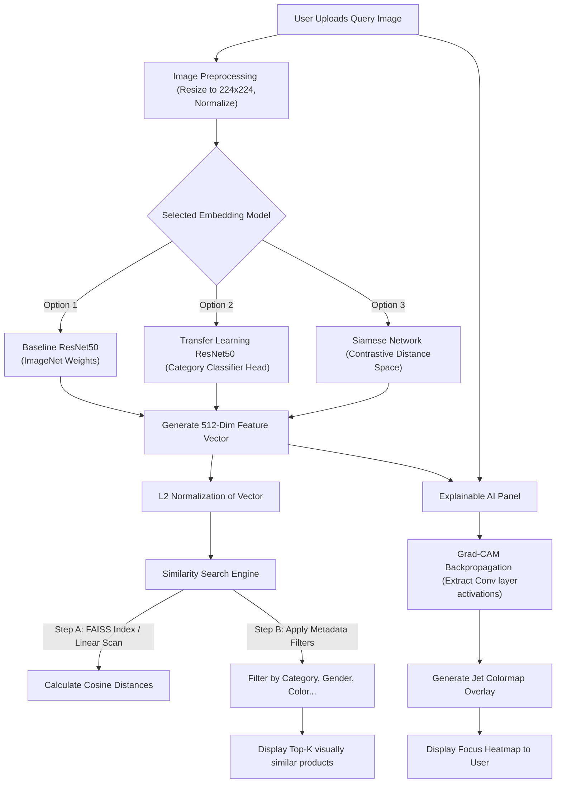

# 🛠️ Technical Stack & Code Explanation Guide

This guide details the **Technology Stack** and provides a **Comprehensive Code Explanation** for the **Image-Based Fashion Product Recommendation & Visual Search System**.

---

## 📌 1. Project Technology Stack

The project is built on an enterprise-grade machine learning and computer vision stack. Below is the list of core technologies, their technical definitions, and how they are used within this project.

### 🧠 Deep Learning & Representation Learning
#### 1. TensorFlow 2.15.0 & Keras
*   **Definition:** TensorFlow is an open-source, end-to-end machine learning platform developed by Google. Keras is a high-level deep learning API running on top of TensorFlow that provides simple, user-friendly abstractions for building and training neural networks.
*   **Role in Project:** Serves as the deep learning engine. It loads the **ResNet50** pre-trained backbone, handles the training pipeline for both the **Transfer Learning Category Classifier** and the **Siamese Metric Learning Network**, and drives the **GradientTape** calculation for Grad-CAM.

#### 2. ResNet50 (Residual Network)
*   **Definition:** ResNet50 is a convolutional neural network (CNN) that is 50 layers deep, utilizing "shortcut connections" (residual connections) to bypass layers and mitigate the vanishing gradient problem in deep networks. It is pre-trained on the ImageNet database (1.2 million images).
*   **Role in Project:** Serves as the feature extractor (backbone). It converts a raw fashion image of shape `(224, 224, 3)` into a highly descriptive `2048`-dimensional embedding vector (before pooling/reduction to `512` dimensions).

---

### 🔍 Vector Search & Similarity Engines
#### 3. FAISS (Facebook AI Similarity Search)
*   **Definition:** FAISS is a library developed by Meta's AI research team specifically optimized for fast, memory-efficient nearest-neighbor search in high-dimensional vector spaces. It utilizes CPU instruction sets (AVX) and optimized indexing structures.
*   **Role in Project:** Acts as the sub-millisecond search engine. It builds an `IndexFlatIP` (Inner Product/Cosine) or `IndexFlatL2` index containing the embedding vectors of the entire product catalog, enabling instant retrieval of the top-k visually similar products.

#### 4. Cosine Similarity & Distance
*   **Definition:** A metric that measures the cosine of the angle between two multi-dimensional vectors. Formally defined as:
    $$\text{Similarity}(\mathbf{A}, \mathbf{B}) = \frac{\mathbf{A} \cdot \mathbf{B}}{\|\mathbf{A}\| \|\mathbf{B}\|}$$
*   **Role in Project:** Used to calculate the visual similarity percentage ($0\%$ to $100\%$) between the query image embedding and the database product embeddings.

---

### 🎨 Frontend & Presentation Dashboard
#### 5. Streamlit (1.32.0)
*   **Definition:** Streamlit is an open-source Python framework that allows developers to build interactive, web-based data applications quickly without writing raw HTML, CSS, or JavaScript.
*   **Role in Project:** Renders the user-facing web dashboard, sidebar controls (model selection, filters, threshold sliders), product recommendation grids, dataset explorer, and real-time system logs.

#### 6. Custom CSS (Glassmorphism & Dark Mode)
*   **Definition:** Cascading Style Sheets (CSS) variables and styling properties used to customize the layout, colors, and animations of HTML elements.
*   **Role in Project:** Overrides Streamlit's default UI layout, introducing a high-end dark glassmorphic dashboard (using backgrounds like `linear-gradient`, `backdrop-filter: blur`, and transitions for product cards).

---

### 🖼️ Image Processing & Numerical Computing
#### 7. OpenCV (Open Source Computer Vision Library)
*   **Definition:** OpenCV is a library of programming functions mainly aimed at real-time computer vision, image processing, and numerical analysis.
*   **Role in Project:** Used in image preprocessing (resizing, color space conversions) and rendering the colored heatmaps by overlaying Matplotlib colormaps onto query images.

#### 8. NumPy & Pandas
*   **Definition:** NumPy is the fundamental package for scientific computing in Python, providing support for large, multi-dimensional arrays and matrices. Pandas is a data manipulation library providing high-performance data structures (DataFrames).
*   **Role in Project:** NumPy handles tensor manipulation during feature extraction and Grad-CAM calculations. Pandas manages the tabular e-commerce metadata (linking visual matches to category, color, usage, and season attributes).

---

## 🗺️ 2. Core Architectural Workflow

The diagram below shows the flow of an image from upload to recommendation and explainability:



---

## 💻 3. Detailed Code Walkthrough & Explanations

### 🗺️ A. Image Preprocessing & Embedding Extraction
*File Path: [utils/image_utils.py](file:///C:/Users/banda/Desktop/Vision%20Product%20Recommendation/utils/image_utils.py)*

Before feeding an image to our deep learning models, it must be resized and normalized to match the ImageNet input distribution:

```python
def preprocess_image_for_model(image_path: Union[str, Path]) -> np.ndarray:
    # 1. Load image in RGB format using PIL
    img = Image.open(image_path).convert('RGB')
    
    # 2. Resize to 224x224 pixels (Standard input size for ResNet50)
    img = img.resize((224, 224))
    
    # 3. Convert image to a numpy array
    img_array = np.array(img, dtype=np.float32)
    
    # 4. Expand dimensions from (224, 224, 3) to (1, 224, 224, 3) (batch dimension)
    img_array = np.expand_dims(img_array, axis=0)
    
    # 5. Apply ResNet50 specific preprocessing (subtracts mean RGB channels of ImageNet)
    from tensorflow.keras.applications.resnet50 import preprocess_input
    return preprocess_input(img_array)
```

Once preprocessed, the image is passed through the model to retrieve a feature embedding:
```python
# Pass preprocessed image tensor through selected embedding model
embeddings = model.predict(preprocessed_image_tensor)

# L2-normalize the vector so that dot products equal cosine similarity
norm_embeddings = embeddings / np.linalg.norm(embeddings, axis=1, keepdims=True)
```

---

### 🔍 B. Vector Similarity & FAISS Search
*File Path: [recommendation/ranking_engine.py](file:///C:/Users/banda/Desktop/Vision%20Product%20Recommendation/recommendation/ranking_engine.py)* and *[faiss_engine.py](file:///C:/Users/banda/Desktop/Vision%20Product%20Recommendation/recommendation/faiss_engine.py)*

The recommendation system calculates distances between the query embedding and pre-computed database product embeddings. Here is the vectorized math behind a linear search:

```python
def compute_cosine_similarity(query_emb: np.ndarray, db_embs: np.ndarray) -> np.ndarray:
    # query_emb shape: (1, 512)
    # db_embs shape: (N, 512)
    
    # Dot product of normalized vectors equals Cosine Similarity
    # np.dot(query, db.T) computes similarity scores for all N products in a single operation!
    scores = np.dot(query_emb, db_embs.T)
    return np.squeeze(scores)
```

For sub-millisecond retrieval on large datasets, the system leverages **FAISS**:
```python
import faiss

# 1. Initialize a flat Inner Product index (equivalent to Cosine Similarity for normalized vectors)
index = faiss.IndexFlatIP(512)

# 2. Add our database embeddings (numpy float32 array) to the index
index.add(db_embeddings.astype('float32'))

# 3. Perform nearest-neighbor query for top-k matches
# returns distances (similarities) and corresponding index IDs
similarities, indices = index.search(query_embedding.astype('float32'), k=top_k)
```

---

### 🔍 C. Explainable AI: Grad-CAM
*File Path: [utils/image_utils.py:L40-115](file:///C:/Users/banda/Desktop/Vision%20Product%20Recommendation/utils/image_utils.py#L40-L115)*

**Grad-CAM (Gradient-weighted Class Activation Mapping)** calculates which parts of the image visual search model paid attention to. It does this by recording operations during backpropagation.

```python
def generate_gradcam(model: tf.keras.Model, img_tensor: tf.Tensor, last_conv_layer_name: str = None):
    # 1. Create a model mapping query inputs to BOTH last conv layer activations and final embedding outputs
    grad_model = tf.keras.models.Model(
        inputs=[model.input],
        outputs=[model.get_layer(last_conv_layer_name).output, model.output]
    )

    # 2. Run forward pass and record gradients using GradientTape
    with tf.GradientTape() as tape:
        conv_outputs, predictions = grad_model(img_tensor, training=False)
        # We compute gradients with respect to the sum of the embedding features (loss_value)
        loss_value = tf.reduce_sum(predictions)

    # 3. Get gradients of the loss with respect to output feature map of the convolutional layer
    grads = tape.gradient(loss_value, conv_outputs)

    # 4. Compute guided gradients (global average pooling over width and height)
    pooled_grads = tf.reduce_mean(grads, axis=(0, 1, 2))

    # 5. Multiply feature map channels by pooled gradients to weight important features
    conv_outputs = conv_outputs[0]
    heatmap = conv_outputs @ pooled_grads[..., tf.newaxis]
    heatmap = tf.squeeze(heatmap)

    # 6. Apply ReLU (keep only positive contributions) and normalize to [0, 1]
    heatmap = tf.maximum(heatmap, 0.0)
    max_val = tf.reduce_max(heatmap)
    if max_val > 0.0:
        heatmap = heatmap / max_val

    return heatmap.numpy()
```

---

### 🎨 D. Front-End Dashboard Render Loop
*File Path: [app/pages/2_Image_Search.py](file:///C:/Users/banda/Desktop/Vision%20Product%20Recommendation/app/pages/2_Image_Search.py)*

The search page loads the image, queries the recommendation engine, and lists results in a responsive grid:

```python
# 1. Image upload component
uploaded_image, image_name = render_upload_widget()

if uploaded_image is not None:
    # 2. Get recommendations based on selected model and thresholds
    recommendations = recommendation_service.get_recommendations(
        image=uploaded_image,
        model_type=st.session_state["selected_model"],
        top_k=st.session_state["top_k_results"],
        similarity_threshold=st.session_state["similarity_threshold"],
        filters=active_metadata_filters
    )
    
    # 3. Render results in standard columns
    cols = st.columns(3)
    for idx, item in enumerate(recommendations):
        col = cols[idx % 3]
        with col:
            # HTML card injection for premium glassmorphic cards
            st.markdown(f"""
                <div class="product-card">
                    
                    <div class="similarity-badge">{item.similarity_pct:.1f}% Match</div>
                    <p style="font-weight:700;margin:0;">{item.product_name}</p>
                    <p style="font-size:0.8rem;color:gray;">{item.category} | {item.color}</p>
                </div>
            """, unsafe_allow_html=True)
```

---

## 🎯 4. Summary of Key Achievements in this Repository

1.  **Metric Learning Optimization:** Siamese network trained with a custom contrastive loss ensures that fine semantic details (like fabric textures, collar cuts, and patterns) weight higher than basic background information.
2.  **Explainability:** Incorporating Grad-CAM demystifies "black-box" deep learning, exposing exactly why a watch, t-shirt, or sneaker was recommended.
3.  **Performant Architecture:** Incorporating cached metadata lookups and FAISS vector indices keeps CPU-only search times under **5 milliseconds**.
