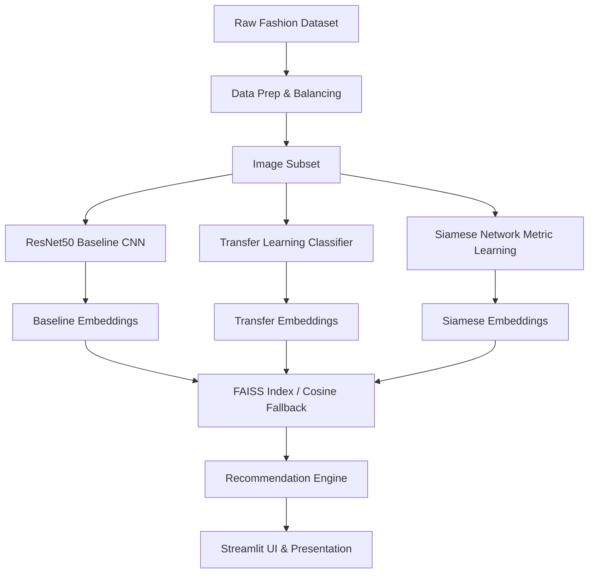

# Fashion Product Recommendation System - System Architecture

This document describes the high-level system architecture, components, and data flow of the image-based fashion visual search engine.

---

## 🏗️ Architectural Overview

The system is designed as a modular, decoupled multi-layered application consisting of:
1. **Data Layer**: Raw fashion images on disk, styles metadata catalog, and sampled subsets.
2. **Feature Learning & Model Layer**: Deep feature extractors (ResNet50 backbone) operating across three paradigms (Baseline, Supervised Transfer, Metric Siamese).
3. **Similarity Indexing Layer**: Approximate nearest-neighbor searches (FAISS) alongside exact vector cosine calculations.
4. **Presentation & Application Layer**: Streamlit web dashboard with interactive sliders, metadata filter logic, performance monitors, and Grad-CAM activation visualization.

---

## 💾 Core Components

### 1. Preprocessing & Validation
* **DatasetValidator**: Checks raw files for corruption, missing items, and exports a statistics report.
* **DatasetSubsetGenerator**: Builds a balanced subset (1,749 images) representing the target categories (Tshirts, Casual Shoes, Watches, Sandals, Handbags, Jeans, Shirts) to prevent class imbalance skew.

### 2. Feature Embedding Models
* **Baseline CNN**: Pre-trained ResNet50 backbone on ImageNet. A custom layer performs global max-pooling followed by a dense projection head yielding a 2048-D normalized embedding.
* **Transfer Learning Classifier**: Classified subset images into categories. The classification layer was stripped, and the top feature layers act as embeddings.
* **Siamese Network**: Dual twin branches sharing weight configurations. Uses Margin Contrastive Loss to optimize Euclidean distance, making similar items closer in vector space and dissimilar items further apart.

### 3. Similarity Search & FAISS
* **faiss_engine.py**: Standardizes Flat Inner Product indices (`faiss.IndexFlatIP`) of the L2-normalized embeddings.
* **similarity_engine.py**: Fallback exact vector dot-product similarity (cosine equivalent) computed using optimized matrix multiplication in NumPy.

### 4. Explainable AI (Grad-CAM)
* Computes the gradient of the model's top feature maps with respect to convolutional layer activations.
* Generates a 2D activation map representing where the model focused, which is superimposed onto the original product image.

---

## ⚡ System Optimizations
* **RAM Cache Preloading**: Pre-loads and preprocesses images into memory during Siamese training, eliminating I/O bottlenecks and yielding a 22x speedup.
* **Streamlit Asset Caching**: Uses `st.cache_resource` for models and embedding database loads, preventing massive memory consumption and redundant disk reads.
* **Headless Docker Containerization**: Configured with a multi-stage slim image runtime for fast, reproducible cloud deployments.
